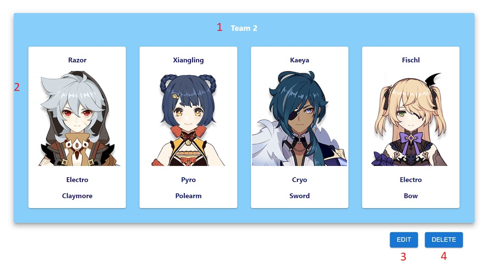

# Genshin Team Creator

Genshin Team Creator (GTC) is a Single Page Application built in React that helps players create, edit, and save different team compositions for the game "Genshin Impact".

## Description

GTC is an application designed to be a tool to assist in creating and saving team compositions for Genshin Impact.  Genshin Impact has a large cast of characters from which teams of four can be assembled.  The game rewards players for creating different team compsitions to take on different challenges and enemies. GTC streamlines the team-building process by helping players keep track of the different teams they have assembled and displays the character details for each team member in an easy-to-read manner.  Additionally, GTC makes it easy to edit one's pre-existing teams with the click of a button. If a player wants to change the team name, a character or multiple characters in a team it's as simple as selecting a replacement from a drop-down menu.

GTC is also great for theory-crafting your next team. On the "Character" page a player can search or filter characters by name, vision type, weapon or rarity.  This makes it as-easy-as-ever to find the best characters for your team!

With its intuitive layout and simple-but-feature-rich design GTC is the premier Team Creator app for Genshin Impact and more features will be coming in the future!

## Installation

Prerequisites:

1. Node.js: Node.js is a JavaScript runtime environment that is used for building server-side applications. It is also required for running React projects. You can download the latest version of Node.js from their official website.

2. npm (Node Package Manager): npm is a package manager for Node.js that allows you to download and install packages and dependencies that are required for your React project. npm is included with Node.js, so you don’t have to install it separately.

3. Git: Git is a version control system that is used for tracking changes in source code. You’ll need to have Git installed in order to download the React project from GitHub. You can download the latest version of Git from their official website.

Once you have these prerequisites installed, you can follow these steps to download Genshin Team Creator from Github and run it on your computer:

It is highly recommended to fork the repository before cloning it.  If you do so then follow the example below but substitute your forked repository address instead of the original address.

1. Clone the repository: Here are the steps to clone a GitHub repository for a React app:

Open your web browser and navigate to https://github.com/sama-cc/phase-2-project.
On the right-hand side of the page, click on the “Code” button.
In the drop-down menu, select HTTPS (or the method that you prefer, we will be using HTTPS in the example) to clone the repository.

Click the “Copy” button to copy the URL of the repository to your clipboard.

Now Open the terminal or command prompt and navigate to the directory where you want to store this repository. Then, run the following command to clone the repository:

`git clone https://github.com/sama-cc/phase-2-project.git`

2. Navigate to the project directory: After the repository is cloned, navigate to the project directory using the following command:

`cd <repo-name>`

3. Install dependencies: Once you’re inside the project directory, run the following command to install the dependencies required for the project:

`npm install`

This command will read the package.json file in the repository and download all of the dependencies listed there.

In case of issues shown after the npm install, run the below to automatically fix the issues:

`npm audit fix`

4. Start the development server by running the following command:

`npm run dev`

Genshin Team Creator uses json server as its back-end.

Information about json server can be found [here](https://github.com/typicode/json-server).

The json server template I use for (GTC) as well as instructions on how to use it can be found [here](https://github.com/sama-cc/json-server-template).

## Usage

### Home

Upon loading the application in your web browser you will see the following displayed:

 - Here on the home page you can see a brief greeting message.

1. Nav bar - Use the Nav Bar to navigate between the "Home", "Characters" and "Teams" pages. 

### Characters

This page contains a card-based grid-style character list containing all available characters. The Search Bar can be used to find a specific character and the filters can be used to narrow down characters based on selected parameters.

1. Name Search - This input field on the search bar allows for searching through the character list by character name. Partial matches are allowed. (ex. searching the letter "b" will return any character with the letter "b" in their name) This input is not case-sensitive. The search button must be activated or the "Enter" key must be pushed to initiate the name search.

2. Search Button - Activating this button will initiate the name search using whatever was entered in the Name Search input field.

3. Filter Option Selectors - Three seperate drop=down selectors can be used to filter the character list. Any combination of filters can be used. 
    - Vision selector - This allows for filtering the character list by Vision type.
    - Weapon selector - This allows for filtering the character list by Weapon type.
    - Rarity selector - This allows for filtering the character list by Rarity (4 Star or 5 Star).

4. Filter Button - Activating the filter button initiates the filter parameters of the character list.

5. Reset Button - Resets the search and filter parameters to default showing all characters in the character list.

6. Character Card List - By default all characters will be displayed. When a filter or search query is initiated the results of the query will show here.

### Teams

The Teams page contains a form for submitting new Teams as well as a Team List that shows all of the already saved teams. The saved teams can be edited or deleted.

#### Create Team Form

1. Team Name Field - This input field is where the name of the team is entered.  If a name is not entered when the team is saved then a name will be autogenerated using the format (Team #) where # is the next unused number in your team names in ascending order.

2. Character Selectors - Drop down selectors for Character 1-4. As you select a character for each slot the preview for that slot will be updated with that character's image and information in real time. The same character can not be selected more than once for a team.

3. Character Previews - This area shows a preview of your currently chosen team composition.

4. Save Button - Activating this button will save the team and add it to the Team List.

#### Team List

1. Team Name - Displays the team's current name.

2. Character Cards - Displays character information for characters 1-4.

3. Edit Button - Activating this button will show the Edit Team Form. Activating this button again will hide the Edit Team Form.

4. Delete Button - Activating this button will delete the corresponding team. A confirmation prompt will appear before the team is deleted.

#### Edit Team Form

1. Team Name Field - This input field is where the name of the team is entered.  If a name is not entered when the team is saved then a name will be autogenerated using the format (Team #) where # is the next unused number in your team names in ascending order.

2. Character Selectors - Drop down selectors for Character 1-4. This will be autofilled with the current team composition of the team. The same character cannot be selected more than once for a team.

3. Save Button - Activating this button will update the team with the edited fields.

## Video Walkthrough

Follow the link below for a video walkthrough.

## FAQ

- Q. I keep getting an alert saying "The character is already on the team!"

    A. Currently, in Genshin Impact, you cannot have the same character twice on your team while playing in singleplayer mode. This application was designed for singleplayer as one does not have control over what characters another player will have in co-op mode.

- Q. When I Search or filter characters on the character page nothing shows up.

    A. This is because no character meets your search or filter criteria.

- Q. I noticed information that is innacurate. Can you please fix it?

    A. Please contact me using the email listed in the Support section.

- Q. I am experiencing a bug. Can I get help?

    A. Please contact me using the email listed in the Support section.

## Roadmap

- Change card backs to match the color of the rarity for each character.
- Show the Elemental Resonance for each team.
- Show recommended teams based on characters already chosen.
- Show recommended character builds.
- Add dendro characters or new characters in general.
- Add the different versions of the Traveller.

## Support

If you have any questions regarding how Genshin Team Comparer is used or encounter any issues please feel free to contact me using the contact information below.

Email: sam.camhi@gmail.com

## Contributing

Pull requests are welcome. For major changes, please open an issue first
to discuss what you would like to change.

## Credit

Below is a list of materials that I did not create and must give credit:

1. https://www.geeksforgeeks.org/how-to-download-a-react-project-from-github-and-run-in-my-pc/ - Used as a template for installation instructions.

## License

[MIT](https://choosealicense.com/licenses/mit/)